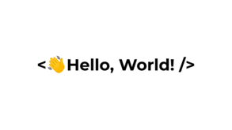

  
<h1 align="center">I'm Maximiliano Effron</h1>
<h3 align="center">Frontend Developer Jr.</h3>

<h3 align="left">I'm Systems Analyst with more than 13 years of experience in analysis and software development.
Passionate about technology, versatile, proactive, methodical, constantly looking for new challenges and always looking for continuous improvement for myself and my team.</h3>

- 🌱 I’m currently learning **Javascript**

- 📫 How to reach me **maximiliano.effron@gmail.com**

<h3 align="left">Languages and Tools:</h3>

 

 
 
 

<h3 align="left">Others Skills:</h3>

 - Visual Basic 6 

 - C++: Used only to make dll library's to use with Pervasive database. 

 - Visual Studio Code 

 - Tortoise SVN 

 - Basic knowledge about Aodbe XD 

<h3 align="left">Connect with me:</h3>

